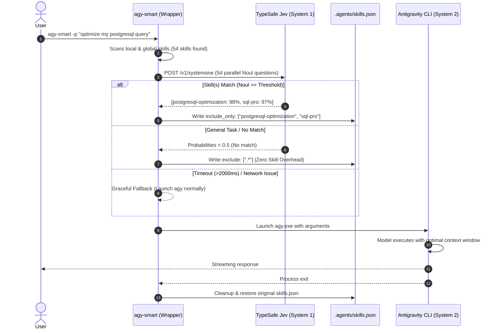

# Antigravity System One (`agy-smart`)

[](https://opensource.org/licenses/MIT)
[](https://nodejs.org/)
[](https://docs.typesafe.ai)
[](https://antigravity.google)

**Antigravity System One (`agy-smart`)** is a high-speed, token-efficient intelligence router for the **Google Antigravity CLI (`agy`)**. Powered by **TypeSafe's Jev System 1 model**, it classifies and filters specialized skills on-the-fly *before* delegating tasks to the primary reasoning LLM (System 2).

---

## ⚡ The Problem vs. The System 1 Solution

### The Problem
By default, Antigravity discovers and mounts all installed skills (often 50+ skills across workspace and global scopes) into the primary model's context window. 
* **Context Bloat:** 50+ skills add **3,000 to 8,000+ tokens** to every prompt turn.
* **Higher Latency:** Large prompt overhead increases Time-To-First-Token (TTFT).
* **Unnecessary Cost:** You pay input token costs for skills that are never used.

### The System 1 Solution
`agy-smart` decouples **routing** from **reasoning**:
1. **Ultra-Fast Classification:** Evaluates candidate skills via TypeSafe Jev in parallel using typed `Noul` (probability) questions in **<800ms**.
2. **Selective Mounting:** Dynamically generates a session-scoped `.agents/skills.json` using Antigravity's native `include_only` directive.
3. **Zero-Token General Mode:** If the request is general coding or conversation, all skills are excluded (`exclude: [".*"]`), saving 100% of skill token overhead.
4. **Resilient Lifecycle:** Automatically restores or removes temporary configuration upon exit or interrupt (`Ctrl+C`).

---

## 🏛️ Architecture Workflow



---

## ✨ Features

* **Zero-Dependency Core:** Pure Node.js ESM built on native platform primitives (`fetch`, `child_process`, `loadEnvFile`).
* **Hybrid Context-Aware Follow-Up Routing:** Follow-up prompts (`"continue"`, `"fix this"`, `"why"`, etc.) automatically inherit topic context from previous conversation turns to prevent dropping specialized skills during multi-turn coding sessions.
* **Skill Sensitivity Multipliers (`skillWeights`):** Fine-tune routing sensitivity per skill (`0.5x` to `1.5x`) to prioritize preferred frameworks or dampen noisy skills.
* **Multi-Skill Calibration:** Supports 0, 1, or multiple skills per request, sorted by effective probability and capped at `maxSkills`.
* **Real-Time Metered Web Dashboard:** Interactive Bootstrap 5 dashboard with live speedometer gauges, token savings meters, latency trend timeline, and an audit table.
* **Interactive Live Bench & Skills Matrix:** Test prompts in the dashboard with optional prior context, adjust skill sensitivity sliders with instant persistence, and observe live Jev probability distributions in real time.
* **Native OS Integration:** Includes native wrappers for PowerShell (`.ps1`), CMD (`.cmd`), and Unix/WSL bash.

---

## 🚀 Installation & Setup

### Prerequisites
* **Node.js** >= v20.6.0 (Native `.env` support required)
* **Google Antigravity CLI** (`agy`) installed
* **TypeSafe API Key** ([Sign up at TypeSafe](https://typesafe.ai))

### 1. Clone & Link Globally
```bash
git clone https://github.com/sarayutbit58/antigravity-systemone.git
cd antigravity-systemone
npm install
npm link
```

### 2. Configure Your API Key
Copy `.env.example` to `.env` and add your TypeSafe API key:
```bash
cp .env.example .env
```
Inside `.env`:
```env
TYPESAFE_API_KEY=your_typesafe_api_key_here
```

---

## 💻 CLI Usage

Use `agy-smart` exactly as you would use `agy`:

```bash
# Interactive mode
agy-smart -i "Build a responsive React landing page"

# Single prompt (Print mode)
agy-smart -p "Optimize my postgresql query with joins"

# Dry-run mode: View Jev's selection without launching agy
agy-smart --dry-run -p "Deploy container to Kubernetes cluster"

# Verbose mode: Inspect Noul probability distribution for every skill
agy-smart --dry-run --verbose -p "Review my GitHub Actions CI workflow"

# Launch the Web Performance Dashboard
agy-smart --dashboard
```

---

## 📊 Metered Performance Web Dashboard

Launch the built-in real-time dashboard to visualize routing efficiency and token savings:

```bash
agy-smart --dashboard
# or
npm run dashboard
```
Open your browser at **`http://localhost:3737`**:

* **Response Speedometer:** Real-time gauge tracking millisecond routing latency.
* **Context Efficiency Meter:** Cumulative percentage of tokens prevented from flooding the LLM context.
* **Token Savings & Cost Estimator:** Real-time calculation of saved input tokens and estimated API costs.
* **Interactive Test Bench:** Type any prompt to test live Jev System 1 classifications without launching an agent.
* **Audit Logs:** Historical telemetry table of routing decisions.

---

## ⚙️ Configuration Reference

Settings can be customized via `~/.gemini/antigravity-cli/agy-smart.config.json` or environment variables:

| Option | Env Variable | Default | Description |
| :--- | :--- | :--- | :--- |
| `threshold` | `AGY_SMART_THRESHOLD` | `0.5` | Minimum Noul probability required to load a skill (0.0 to 1.0) |
| `timeoutMs` | `AGY_SMART_TIMEOUT_MS` | `2000` | Maximum wait time for Jev API before falling back to default |
| `maxSkills` | `AGY_SMART_MAX_SKILLS` | `5` | Hard cap on the maximum number of skills loaded per prompt |
| `verbose` | `AGY_SMART_VERBOSE` | `false` | Enable detailed probability bar visualization |
| `skillWeights` | — | `{}` | Per-skill sensitivity multipliers (e.g. `{"docker-expert": 1.3}`) |
| `port` | `AGY_DASHBOARD_PORT` | `3737` | Local HTTP port for the web dashboard |

---

## 🧪 Verification & Tests

Run the built-in test suites:

```bash
# Run CLI & Router unit tests
npm test

# Run Web Dashboard API tests
node test-dashboard.mjs
```

---

## 📄 License

This project is licensed under the [MIT License](LICENSE).
